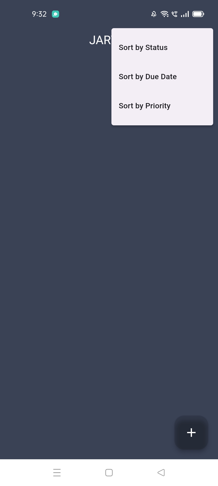

The project includes a user friendly TODO list app
## The app name is JARVIS ( Just a Rather Very Intelligent System )
Features: 
-> The Title of task with an optional Description 
-> And user can set the Due date.
-> It provides Priority levels to align tasks as LOW, HIGH, AND MEDIUM.
-> As tasks belongs to distinct Categories like Work, Personal,Shopping and Others.
-> Task status can be varied such as ToDo, InProgress, and Done.
-> Completed tasks can be deleted if user feels it is not needed.
-> The data of tasks can be stored in local database within app through shared preferences.
-> The works can be aligned by sorting them according to their status levels or Due Date, as well as by their priority.

## Screen shots of todolist app:
## Home Screen

## Aligning tasks

## Creating new Todo

## Sample task creation

## Deletion of task

## Sorting by status

## Sorting by Priority

## Sorting by Due Dates

